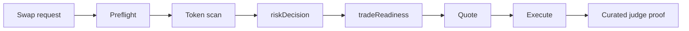

# xlayer-trade-guard

`xlayer-trade-guard` is a guarded X Layer swap skill for the OKX Build X
Hackathon. It applies explicit OKX / OnchainOS control checks before quote or
execute, then records a judge-readable proof surface for one narrow live path.

This submission is intentionally scoped as a single-agent control skill:

- one chain: `X Layer Mainnet`
- one guarded pair: `okb -> usdc`
- one live amount: `0.0005`
- one control pipeline
- one curated proof bundle for review

## Judge Snapshot

A judge can verify the public submission from one canonical pointer:
[artifacts/judge-proof/latest.json](artifacts/judge-proof/latest.json).

Current public proof posture:

- Network: `X Layer Mainnet (eip155:196)`
- Submission type: `single-agent`
- Arena fit: `Skills Arena`
- Guarded live path: `okb -> usdc`, amount `0.0005`
- Transaction submission proof:
  [`0x84c0644df08e308653a5526591666837cd4f321cfe039be71062dee3ba1d2bc9`](https://www.okx.com/web3/explorer/xlayer/tx/0x84c0644df08e308653a5526591666837cd4f321cfe039be71062dee3ba1d2bc9)
- Local verification snapshot: `16` passing test files, `76` passing tests,
  plus `pnpm typecheck` and `pnpm build`

## Project Intro

The repo exists to answer one question before a swap is allowed to move
forward: should this request stop, pause, quote only, or proceed to execution?

Instead of presenting a generic trading assistant, `xlayer-trade-guard`
separates trade controls into explicit machine-readable decisions:

- `riskDecision`
- `tradeReadiness`
- `executionState`

That makes the workflow easier to audit. A judge can inspect one request, one
control path, and one proof bundle without inferring hidden behavior.

## What Risk It Controls

This skill is built as a control layer in front of a narrow swap path.

It checks:

- runtime readiness for the X Layer path
- token-scan output for the destination token
- whether the request should stop, pause, or continue
- whether quote access and execute readiness should remain distinct

It does not claim to be:

- a generic trading bot
- a multi-pair routing engine
- a wallet product
- a final confirmation tracker beyond submitted-transaction proof

## Architecture



Operational flow for this submission:

1. accept one bounded swap request on `eip155:196`
2. run preflight checks for CLI readiness and X Layer support
3. run the OKX token scan for the target token
4. derive `riskDecision`
5. derive `tradeReadiness`
6. quote when controls allow it
7. attempt execute only when the request is ready
8. write the proof surface carried by the public submission bundle

## Deploy Address / Onchain Identity And Live Proof

Submission posture for this version:

- Submission type: `single-agent`
- Arena fit: `Skills Arena`
- Network: `X Layer Mainnet (eip155:196)`
- Agentic Wallet identity:
  `0xfeff3812a78e25dd8c234a33980723ce19725433`
- Standalone deployed contract:
  `none in this Skills Arena version`
- Live transaction submission proof:
  [`0x84c0644df08e308653a5526591666837cd4f321cfe039be71062dee3ba1d2bc9`](https://www.okx.com/web3/explorer/xlayer/tx/0x84c0644df08e308653a5526591666837cd4f321cfe039be71062dee3ba1d2bc9)

Proof boundary for this repo:

- `executionState = submitted` means transaction submission proof
- this release does not claim final on-chain confirmation
- judge-facing proof should start from:
  `artifacts/judge-proof/latest.json`

## Skill Usage

The current control path uses official OKX / OnchainOS command families on
X Layer:

- `onchainos security token-scan`
- `onchainos swap quote`
- `onchainos swap execute`

Bounded usage in this release:

- one guarded `okb -> usdc` path
- one live execute submission proof path
- one artifact-backed review surface for judges

The repo does not oversell broader capability than the current evidence. The
public story stays tied to the narrow path recorded in the proof bundle.

## Verification Snapshot

The current public snapshot has been verified locally with:

- `pnpm test`
- `pnpm typecheck`
- `pnpm build`

At the time of this README update, `pnpm test` passes with:

- `16` passing test files
- `76` passing tests

This public snapshot includes both source tests and mirrored compiled tests
under `dist/`, so the verification number above reflects the current public
checkout rather than source-only suites.

Coverage areas include contracts, decision logic, workflow evaluation,
argument parsing, artifact writing, artifact summaries, and OnchainOS
normalization.

## Machine-Readable Outcomes

This repo keeps the decision surface explicit:

- `riskDecision`: `block | pause | warn | proceed`
- `tradeReadiness`: `cannot | can_quote | can_execute`
- `executionState`: `not_attempted | submitted | confirmed | failed`

The workflow also emits machine-readable reason codes for bounded stop or warn
states. Representative examples include:

- `preflight_cli_unavailable`
- `preflight_wallet_not_ready`
- `scan_level4_block`
- `scan_level3_pause`
- `quote_no_route`
- `execute_failed_after_retry`

See [src/core/reasons.ts](src/core/reasons.ts) for the current canonical set.

## Library Example

The reusable core is the typed guard-decision engine. A consumer can build one
request, feed in preflight / scan / quote facts, and read back the bounded
decision surface. This example assumes a local checkout of this repo after
`pnpm build`:

```ts
import {
  buildProofRequest,
  evaluateTradeGuardWorkflow,
  type PreflightFacts,
  type QuoteFacts,
  type ScanFacts
} from "./dist/index.js";

const request = buildProofRequest("quote_live", {
  amount: "0.0005"
});

const preflight: PreflightFacts = {
  cliReady: true,
  xlayerSupported: true,
  walletReady: true,
  resolvedWalletAddress: "0x1111111111111111111111111111111111111111",
  tokenInResolved: "OKB",
  tokenOutResolved: "USDC",
  reasons: []
};

const scan: ScanFacts = {
  status: "ok",
  effectiveRiskLevel: 2,
  action: "warn",
  triggeredLabels: ["Mintable"],
  summaryLines: ["[L2] Mintable"],
  warnings: []
};

const quote: QuoteFacts = {
  status: "ok",
  expectedOut: "169662",
  priceImpactPercent: "-0.34",
  routeSummary: ["OKB -> USDC"],
  warnings: []
};

const result = evaluateTradeGuardWorkflow({
  request,
  preflight,
  scan,
  quote,
  execute: null
});

console.log(result.riskDecision);
console.log(result.tradeReadiness);
console.log(result.executionState);
```

This example demonstrates decision evaluation only. The public submission's
live proof still comes from the committed judge bundle and the OKX / OnchainOS
CLI-backed path above.

## Source Layout

```text
src/
├── adapters/onchainos/   # OnchainOS command runners + output normalization
├── core/                 # risk decisions, reason codes, workflow evaluation
├── cli/                  # bounded hero commands and arg parsing
└── artifacts/            # summary rendering, trace capture, proof writing
```

## Judge Verification Checklist

A reviewer should be able to verify these claims quickly:

1. the repo exposes `riskDecision` and `tradeReadiness` as separate fields
2. the current live path reaches `executionState = submitted`
3. the execute surface records a real `swapTxHash`
4. the curated proof bundle preserves the material proof facts without raw
   operator traces

A demo video was submitted with the official submission. This public repo
mirrors the same bounded proof path shown in that recording.

## Public Review Order

Start from these files in order:

1. [artifacts/judge-proof/latest.json](artifacts/judge-proof/latest.json)
2. [artifacts/judge-proof/2026-04-15T132739646Z-execute_live-canonical-okb-usdc/manifest.json](artifacts/judge-proof/2026-04-15T132739646Z-execute_live-canonical-okb-usdc/manifest.json)
3. [artifacts/judge-proof/2026-04-15T132739646Z-execute_live-canonical-okb-usdc/proof-summary.md](artifacts/judge-proof/2026-04-15T132739646Z-execute_live-canonical-okb-usdc/proof-summary.md)
4. [artifacts/judge-proof/2026-04-15T132739646Z-execute_live-canonical-okb-usdc/human-approval.md](artifacts/judge-proof/2026-04-15T132739646Z-execute_live-canonical-okb-usdc/human-approval.md)
5. [artifacts/judge-proof/2026-04-15T132739646Z-execute_live-canonical-okb-usdc/explorer-proof.md](artifacts/judge-proof/2026-04-15T132739646Z-execute_live-canonical-okb-usdc/explorer-proof.md)

For most judge review flows, steps `1-3` are enough to verify the core claim.
Steps `4-5` are supporting evidence that strengthen the human-review and
explorer-follow-up story without changing the submitted proof boundary.

## How To Run

Primary verification commands:

```bash
pnpm typecheck
pnpm test
pnpm build
pnpm hero:fallback
pnpm hero:quote-live -- --amount 0.0005
pnpm hero:execute-live -- --amount 0.0005 --gas-level fast --slippage 1
```

Current request boundary:

- fallback path is canonical-only and not submission proof
- live quote and live execute keep one bounded pair and amount for review
- the curated judge-proof bundle is the public review surface for this repo

## Team Info

- Public repo:
  [xsysra/xlayer-trade-guard](https://github.com/xsysra/xlayer-trade-guard)
- Maintainer:
  [`@xsysra`](https://github.com/xsysra)
- Contact email:
  `enconsun@gmail.com`
- Telegram:
  `xsysra`
- Submission mode:
  `single-agent`

## Why This Matters On X Layer

X Layer needs agent-facing controls, not only agent-facing execution. This
submission shows that one narrow swap path can stay auditable from the first
preflight check through transaction submission proof:

- one explicit risk gate
- one execution-readiness decision
- one bounded live path on X Layer
- one proof surface a judge can inspect quickly
